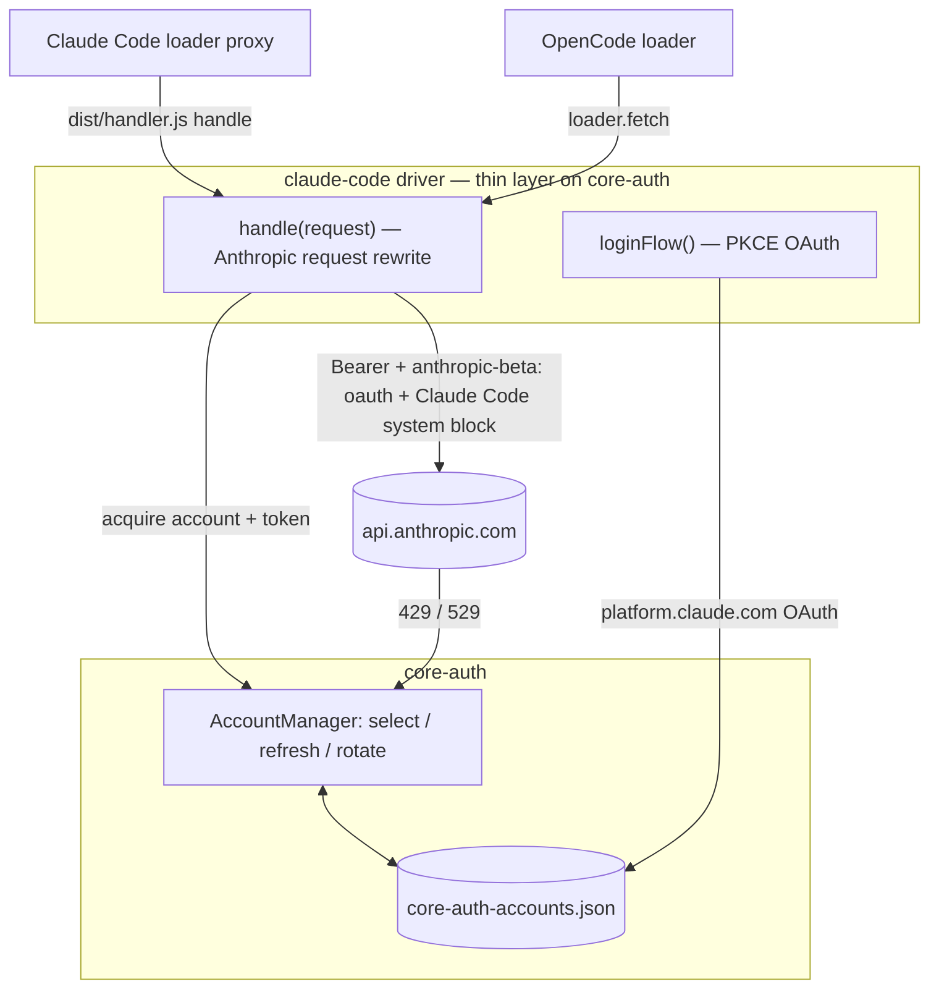

# claude-code-auth

[](https://www.npmjs.com/package/claude-code-auth)
[](https://www.npmjs.com/package/claude-code-auth)
[](https://github.com/intisy-ai/claude-code-auth/actions/workflows/publish.yml)

A [core-auth](https://github.com/intisy-ai/core-auth) provider that signs in to Claude with the real Claude Code OAuth flow and lets you add **multiple Claude subscription accounts**. Both Claude Code (via the loader proxy) and OpenCode route requests through it, rotating accounts and respecting each one's subscription rate limits — so OpenCode uses your Claude Code subscription instead of a pay-per-token API key.

## Under-the-Hood Architecture



## Structure

- `src/` — TypeScript source (`driver/` driver + OAuth config/login, `oauth/` PKCE flow, `plugin/request.ts` Anthropic rewrite, `handler.ts`/`index.ts`/`cli.ts` entries)
- `core-auth/` — the shared auth engine (git submodule)
- `dist/` — Compiled bundles: `index.js` (OpenCode), `handler.js` (Claude loader), `cli.js` (CLI)

## Installation

### Via plugin-updater (recommended)
Add to `~/.config/opencode/config/plugins.json`:
```json
[{ "name": "claude-code-auth", "url": "https://github.com/intisy-ai/claude-code-auth", "enabled": true }]
```

### Via npm
```bash
npm install claude-code-auth
```

Add Claude accounts (shared by both apps):
```bash
npx claude-code-auth login    # repeat to add more accounts
npx claude-code-auth list
```

## Configuration

Accounts are stored by core-auth at `~/.config/opencode/core-auth-accounts.json` (and `~/.claude/...` for Claude Code). The OAuth client is the public Claude Code installed-app client; override the client id with `CLAUDE_CODE_CLIENT_ID` if needed.

- **OpenCode**: registers a custom `claude-code` provider (SDK `@ai-sdk/anthropic`); run `opencode run -m claude-code/claude-sonnet-4-6`.
- **Claude Code**: select `claude-code` in the loader's Providers tab; the proxy routes Claude requests through your subscription accounts.

## Logging

core-auth writes provider logs under the app config dir (`~/.config/opencode/logs/...` or `~/.claude/logs/...`).

## License

MIT
